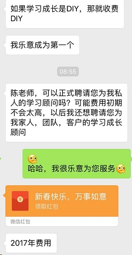

* content
{:toc}

### **01 工具只有适合自己最重要**
***

昨天的[做好知识管理，让你更自由](2017-02-05-KnowledgeManagement.md)文中推荐了一些知识管理的工具，从初级到神级功能是越来越强大，但难度也越来越大。意味着，学习的成本也越来越大，最后的使用成本也是越来越大的。

今天有几位伙伴找我聊了一些话题，其中最困惑的是——**这些工具你在用，可是我也想改变，也想使用这些工具，可还是不会用，能否把你的这些学习方法、工具落地？**

然后有一位老朋友聊着聊着就被他「包养」了。

学习成长一定是DIY的，每个人都有自己适合的学习方法，成长路径。

使用什么样的工具来帮助自己学习成长，也是DIY的。

有些方法、有些工具始终是**别人家**的。

回到前面的话题，想要改变，不懂方法，或是需要有人带领，这很好解决，只要想改变，做好了改变一定会有痛苦的心理准备，就成功一半了。

但如果是有关工具的具体使用方法，这个请参照工具的官方使用说明文档，最重要的还是自己动手操作几次，就妥妥滴的了。(按理说，使用教程是工具软件提供商的事。)

那有人又会疑惑了:「**这么说来，那还要你何用？**」

讲真，在具体如何操作工具上，我实在帮不上太多的忙。如果在使用过程中有疑问，我们可以相互探讨交流。

我能做到的是和你一起探索——**哪些学习方法、工具适合你。**

个人学习成长也是一个非常私人的话题，因为每个人所处的环境、心智水平、职业状态等都不一样。学习方法也好，工具也罢，一定会有一些基本的套路，但最终能落地还是DIY的结果，得找到适合自己的成长路径和工具。

一千个人就有一千种学习方法，我的不一定适合你，你的也不一定适合我。

市面上工具、软件有千万款，**到底我选择哪一款？哪一款适合我用？**需要我们一起去探索。

年前，我删除了手机50多款软件，大部分是学习工具类的(不好意思，我的手机里没有一款游戏，回家小朋友都不爱拿我手机玩，哈哈)。

当时也是因为看到各种达人的推荐，所以就安装来使用。不用不知道，一用才知道原来有些工具始终是别人家的。

**任何东西只有适合自己才最重要。**

学习成长更是如此，也只有自己才知道什么才适合自己。

**如何才能知道哪些适合自己？**

### **02 如何选择合适的工具**
***

如何选到适合自己的工具，有一个最简单粗暴的方法——**大量实践**。使用多了自然就知道。

我把我知道的分享给大家，也可以说是选择工具的原则:

- **认识自己**

既然要选择适合自己的工具，就要全面深入了解自己。

在了解自己从事的职业、正在学习的东西、所处的阶段后，还要多思考几个问题:

>1.我为什么要使用这些工具？
> 
>2.我一定要使用这些工具吗？不用会怎样？
> 
> 3.这些工具能帮助我提升哪些方面？
> 
> 4.它是我当下急需的吗？有其他替代工具吗？

在充分认识自己的前提下，聚焦到一、两较适合的工具，去实践操作对比一下，选择一款工具用着。

工具是用来帮助我们提高效率的，而不是被工具绑架的。

比如在使用番茄钟管理软件的时候，我下载安装了很多同类的软件，再结合自己的实际情况，最后选择「**Forest**」，一直用到现在。

- **学习成本**

在选择工具的时候，除了考虑所谓的用户体验外，还要考虑学习成本。

比如，用Git来做知识管理，这个学习成本是最高的，毕竟它是最高级的，没有中文版都是英文版，对于我来说就是很大的一个门槛。如果还要学习他的命令行也还需要花一定的时间去学习。

如果不是因为要学习编程，要把自己放在Github的情境中去学习，也不会去学习Git这个工具。

不用盲目追求「高大上」的工具，够用就好，适合自己才最重要。

想想自己最常用的工具，自己用溜了吗？

比如，word的使用操作，相信很多功能我们都不会用。

我不会PS，公众号的这图片、gif动画都是用PPT制作的。至少现在呈现的效果自己还挺满意。(见下图)

当然了，自己也动过学习PS的念头，可一直没有强需求，关键是学习成本有点高，就一直搁置了。反而逼自己把PPT用得更溜了。

很多知识管理、公司团队的协作，除了最早使用局域网共享的方法，现在我们团队都用云笔记来协作。局域网共享，离开办公室就无法访问，有很大局限。现在大部分都是用笔记本办公，云笔记可以随时随地进行协作，更快捷、更自由、更高效。

关键是云笔记使用方法的学习成本很低，有使用过word，一打开界面就能上手。

我们选择使用工具是帮助提高效率的，够用就好，适合现阶段的自己，选择学习成本较低的。

- **03 多平台支持**

选择工具时，判断一款软件是否好用，看看是否支持多平台。

多平台是指:

>电脑端:Win系统+OS系统
> 
> 移动端:Android+ios

如办公类型的工具软件，一定要有电脑客户端，毕竟大部分时间都是用电脑来处理文档及信息的，电脑端也要支持Win系统和OS系统。

即使是公司内部都用MAC电脑，也要考虑进行外部协作时，对方是否也同样能打开，或是能完整兼容。

现在云笔记软件一般都是全平台支持的，可以在电脑、手机、平板各个终端上跨平台同步。

不过，如果需要大量的团队内部协作，在选择云笔记来协作时，尽量不选择印象笔记，在协作或是分享上可能会比较尴尬。

**跨平台同步更新，方便快捷分享是关键。**

- **04 适合团队**

在选择使用协作工具时，一定要重点考虑团队协作的便捷性。

如果是公司内部有自己的系统软件就不用纠结了，也没得选择。

如果是自主选择一些工具来协作的，最好是团队使用同一种工具来协作。

不要作，除非你能决定团队所有人和你使用同一工具来协作。

**同一个团队，同一个梦想，同一种工具。**

工具很多，在充分了解自己的前提下，多去实践操作，适合自己才是王道。

请记住:

**学习成长有方法。**
**效率提升用工具。**
**不用追求高大上。**
**适合自己最重要。**